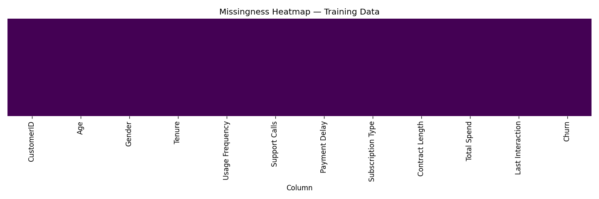
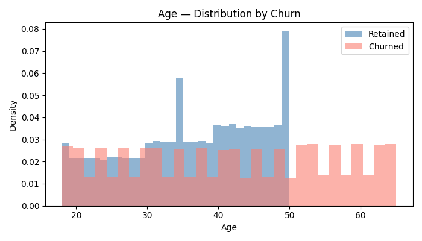
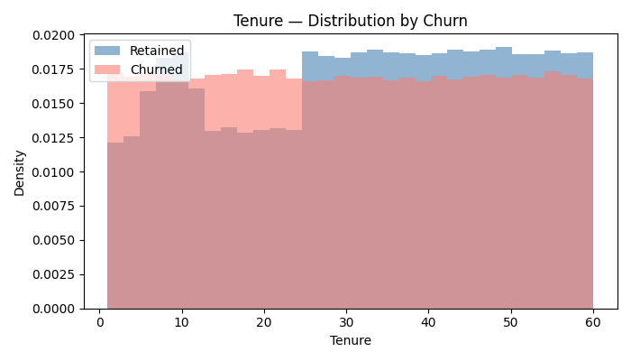
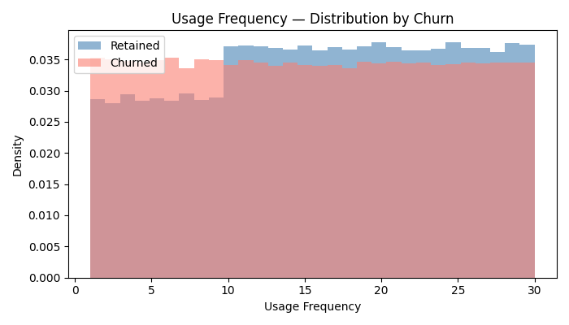
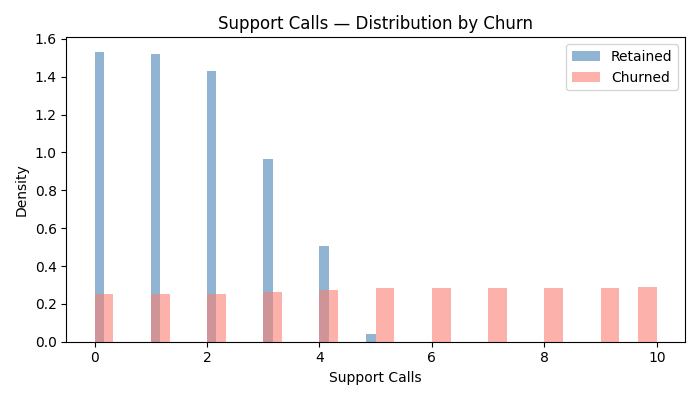
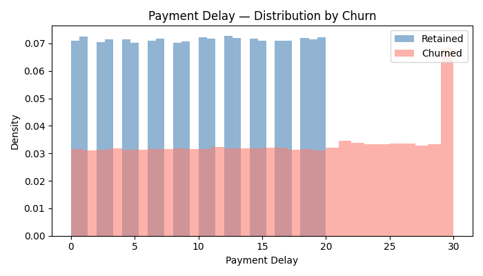
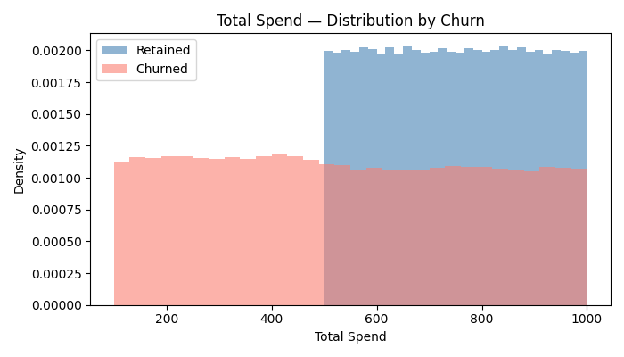
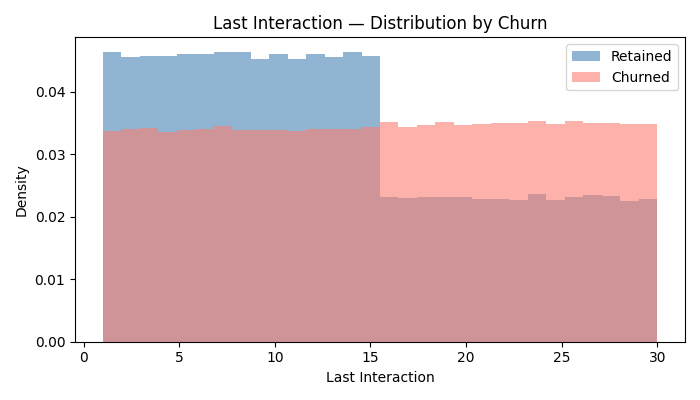
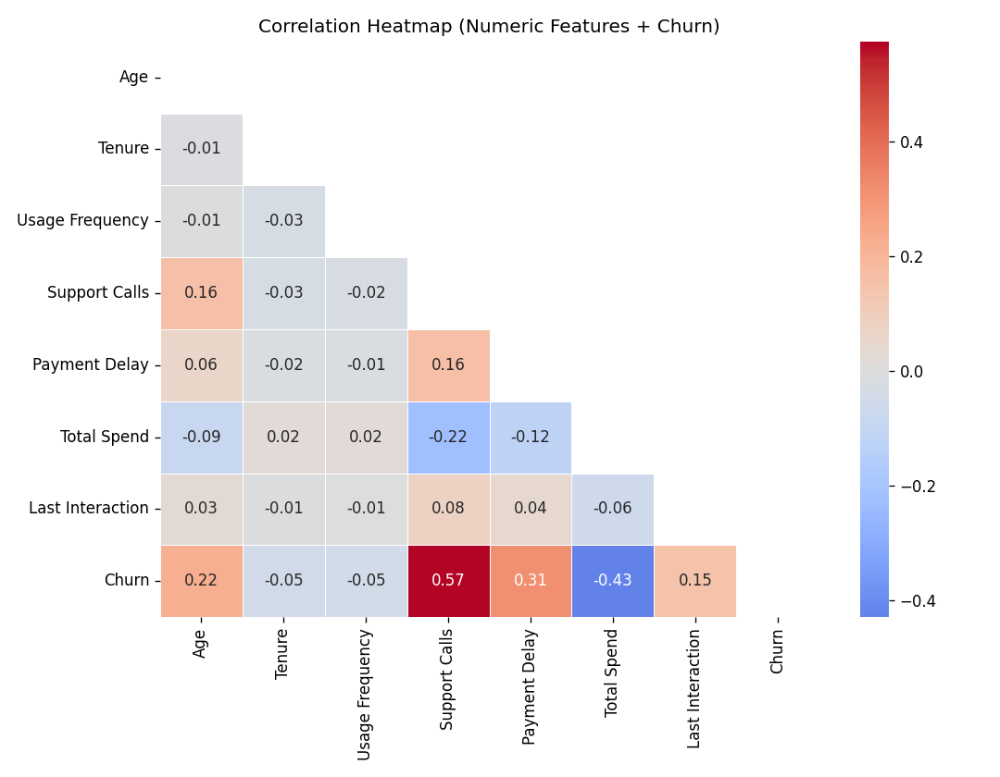

# EDA Report — Churn Prediction Dataset

Generated from `data\raw\customer_churn_dataset-training-master.csv` (train) and `data\raw\customer_churn_dataset-testing-master.csv` (test).

## 1. Dataset Overview

|          |   Rows |   Columns |
|:---------|-------:|----------:|
| Training | 440833 |        12 |
| Testing  |  64374 |        12 |

### Column dtypes (training)

|                   | dtype   |
|:------------------|:--------|
| CustomerID        | float64 |
| Age               | float64 |
| Gender            | object  |
| Tenure            | float64 |
| Usage Frequency   | float64 |
| Support Calls     | float64 |
| Payment Delay     | float64 |
| Subscription Type | object  |
| Contract Length   | object  |
| Total Spend       | float64 |
| Last Interaction  | float64 |
| Churn             | float64 |

## 2. Target Balance

### Training

|              |   Count |   Percentage (%) |
|:-------------|--------:|-----------------:|
| Retained (0) |     nan |              nan |
| Churned (1)  |     nan |              nan |

Churn rate: **56.71%** | Imbalance ratio (churn/retained): **1.310**

### Testing

|              |   Count |   Percentage (%) |
|:-------------|--------:|-----------------:|
| Retained (0) |     nan |              nan |
| Churned (1)  |     nan |              nan |

Churn rate: **47.37%** | Imbalance ratio (churn/retained): **0.900**

## 3. Missingness

### Training

|                   |   Null Count |   Null % |
|:------------------|-------------:|---------:|
| CustomerID        |            1 |   0.0002 |
| Age               |            1 |   0.0002 |
| Gender            |            1 |   0.0002 |
| Tenure            |            1 |   0.0002 |
| Usage Frequency   |            1 |   0.0002 |
| Support Calls     |            1 |   0.0002 |
| Payment Delay     |            1 |   0.0002 |
| Subscription Type |            1 |   0.0002 |
| Contract Length   |            1 |   0.0002 |
| Total Spend       |            1 |   0.0002 |
| Last Interaction  |            1 |   0.0002 |
| Churn             |            1 |   0.0002 |

### Testing

No missing values detected.

## 4. Numeric Column Distributions

|                  |   count |    mean |     std |   min |   25% |   50% |   75% |   max |   skewness |
|:-----------------|--------:|--------:|--------:|------:|------:|------:|------:|------:|-----------:|
| Age              |  440832 |  39.373 |  12.442 |    18 |    29 |    39 |    48 |    65 |      0.162 |
| Tenure           |  440832 |  31.256 |  17.256 |     1 |    16 |    32 |    46 |    60 |     -0.061 |
| Usage Frequency  |  440832 |  15.807 |   8.586 |     1 |     9 |    16 |    23 |    30 |     -0.043 |
| Support Calls    |  440832 |   3.604 |   3.07  |     0 |     1 |     3 |     6 |    10 |      0.667 |
| Payment Delay    |  440832 |  12.966 |   8.258 |     0 |     6 |    12 |    19 |    30 |      0.267 |
| Total Spend      |  440832 | 631.616 | 240.803 |   100 |   480 |   661 |   830 |  1000 |     -0.457 |
| Last Interaction |  440832 |  14.481 |   8.596 |     1 |     7 |    14 |    22 |    30 |      0.177 |

## 5. Categorical Cardinality & Value Counts

### Gender

Cardinality: **2** unique values

| Gender   |   Count |   Percentage (%) |
|:---------|--------:|-----------------:|
| Male     |  250252 |            56.77 |
| Female   |  190580 |            43.23 |
| nan      |       1 |             0    |

Churn rate by category:

| Gender   |   Churn Rate |      N |
|:---------|-------------:|-------:|
| Female   |       0.6667 | 190580 |
| Male     |       0.4913 | 250252 |

### Subscription Type

Cardinality: **3** unique values

| Subscription Type   |   Count |   Percentage (%) |
|:--------------------|--------:|-----------------:|
| Standard            |  149128 |            33.83 |
| Premium             |  148678 |            33.73 |
| Basic               |  143026 |            32.44 |
| nan                 |       1 |             0    |

Churn rate by category:

| Subscription Type   |   Churn Rate |      N |
|:--------------------|-------------:|-------:|
| Basic               |       0.5818 | 143026 |
| Standard            |       0.5607 | 149128 |
| Premium             |       0.5594 | 148678 |

### Contract Length

Cardinality: **3** unique values

| Contract Length   |   Count |   Percentage (%) |
|:------------------|--------:|-----------------:|
| Annual            |  177198 |            40.2  |
| Quarterly         |  176530 |            40.04 |
| Monthly           |   87104 |            19.76 |
| nan               |       1 |             0    |

Churn rate by category:

| Contract Length   |   Churn Rate |      N |
|:------------------|-------------:|-------:|
| Monthly           |       1      |  87104 |
| Annual            |       0.4608 | 177198 |
| Quarterly         |       0.4603 | 176530 |

## 6. Correlation with Target (Churn)

|                  |   Pearson r with Churn |
|:-----------------|-----------------------:|
| Support Calls    |                 0.5743 |
| Total Spend      |                -0.4294 |
| Payment Delay    |                 0.3121 |
| Age              |                 0.2184 |
| Last Interaction |                 0.1496 |
| Tenure           |                -0.0519 |
| Usage Frequency  |                -0.0461 |

> Interpretation: positive r = higher values associated with more churn; negative r = higher values associated with retention.

## 7. Churn Rate by Numeric Quartile

### Age

| Quartile       |   Churn Rate |
|:---------------|-------------:|
| (17.999, 29.0] |       0.5552 |
| (29.0, 39.0]   |       0.4651 |
| (39.0, 48.0]   |       0.4061 |
| (48.0, 65.0]   |       0.8506 |

### Tenure

| Quartile      |   Churn Rate |
|:--------------|-------------:|
| (0.999, 16.0] |       0.5978 |
| (16.0, 32.0]  |       0.5848 |
| (32.0, 46.0]  |       0.5407 |
| (46.0, 60.0]  |       0.5428 |

### Usage Frequency

| Quartile     |   Churn Rate |
|:-------------|-------------:|
| (0.999, 9.0] |       0.6137 |
| (9.0, 16.0]  |       0.5491 |
| (16.0, 23.0] |       0.5492 |
| (23.0, 30.0] |       0.5488 |

### Support Calls

| Quartile      |   Churn Rate |
|:--------------|-------------:|
| (-0.001, 1.0] |       0.3032 |
| (1.0, 3.0]    |       0.3601 |
| (3.0, 6.0]    |       0.8005 |
| (6.0, 10.0]   |       1      |

### Payment Delay

| Quartile      |   Churn Rate |
|:--------------|-------------:|
| (-0.001, 6.0] |       0.4648 |
| (6.0, 12.0]   |       0.4656 |
| (12.0, 19.0]  |       0.4651 |
| (19.0, 30.0]  |       0.9093 |

### Total Spend

| Quartile        |   Churn Rate |
|:----------------|-------------:|
| (99.999, 480.0] |       1      |
| (480.0, 661.0]  |       0.4431 |
| (661.0, 830.0]  |       0.415  |
| (830.0, 1000.0] |       0.4102 |

### Last Interaction

| Quartile     |   Churn Rate |
|:-------------|-------------:|
| (0.999, 7.0] |       0.4923 |
| (7.0, 14.0]  |       0.4925 |
| (14.0, 22.0] |       0.6377 |
| (22.0, 30.0] |       0.6655 |
